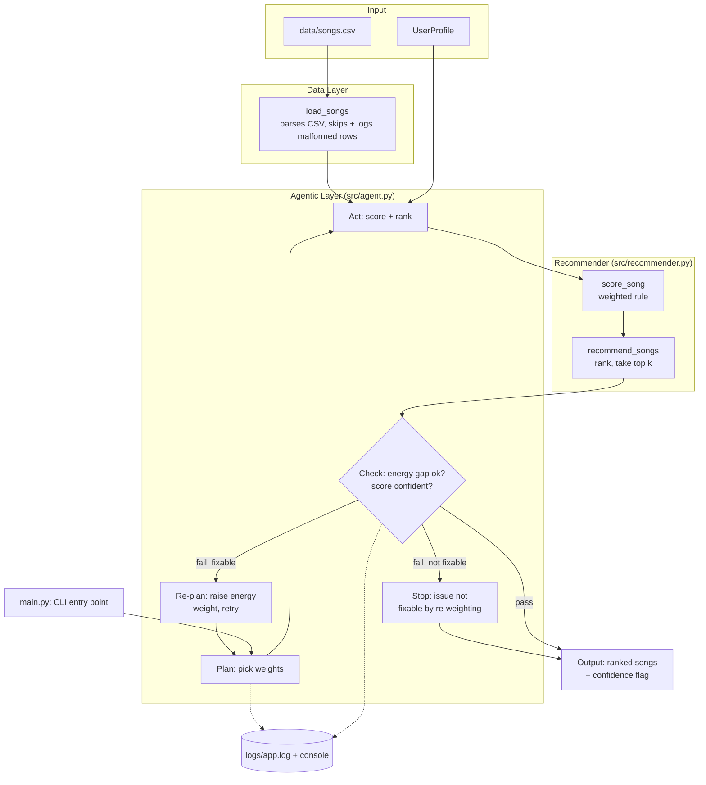

# 🎧 VibeMatch — A Self-Checking Music Recommender

## Original Project

This repository builds on **Music Recommender Simulation**, my Module 3 project for
CodePath's Applied AI course (AI110). The original goal was to build and explain a small
content-based recommender: represent songs and a single user's "taste profile" as data,
design a weighted scoring rule that turns that data into ranked recommendations, and
evaluate where the rule holds up versus where it breaks — including one deliberately
adversarial profile with conflicting signals (a classical/melancholy song requested at
high energy). That version scored an 18-song catalog, ranked it, and printed a
plain-language explanation for every recommendation, but it trusted its own scoring rule
completely — it had no way to notice when its own top pick was a bad match.

---

## Title and Summary

**VibeMatch** is a content-based music recommender that scores an 18-song catalog against
a user's stated taste (genre, mood, target energy, acoustic preference) and returns a
ranked, explained top-5. What makes it more than the original class assignment is an
**agentic self-check layer**: instead of running the scoring rule once and printing
whatever comes out, the system plans a scoring strategy, acts on it, checks its own top
result against explicit guardrails, and retries with an adjusted strategy when a check
fails or honestly reports low confidence when it can't fix what it finds.

This matters beyond music recommendations: any system that turns a score into a
confident-sounding answer (a recommender, a classifier, an LLM response) can be
*fluently wrong* — high-confidence output that's actually a bad match. VibeMatch is a
small, fully-inspectable demonstration of the general fix: don't just trust the top
score, verify it against rules about what a good answer should look like, and say so
when you can't.

---

## Portfolio

**Code:** [github.com/rpathak0211/applied-ai-system-final](https://github.com/rpathak0211/applied-ai-system-final)

**What this project says about me as an AI engineer:** I start from a system's documented
weaknesses instead of chasing the newest technique the agentic layer in this repo exists
because I'd already written down, in `model_card.md`, exactly where the original scoring
rule failed silently, and I built the fix to target that specific failure rather than
bolting on a generic feature. I also pick the smallest mechanism that fits the actual
constraint: an agentic self-check loop over RAG or fine-tuning, because there was no LLM API
key configured for this project and the failure mode I was targeting didn't need one. And I
verify reliability claims with tests instead of assertions — the retry-logic bug in
`src/agent.py` (documented in Section 10 of the model card) was caught by a test written
specifically to break it, not by re-reading the code and deciding it looked fine. Given the
choice, I'd rather ship a system that honestly reports "I'm not confident about this" than
one that always looks confident.

---

## Architecture Overview

Full diagram source: [`diagrams/architecture.mmd`](diagrams/architecture.mmd)



**How to read it:** data flows in from two places — the fixed song catalog and the
current `UserProfile` — into the **Recommender** module, which is unchanged in spirit
from the original project (a weighted-points scoring rule, sorted and truncated to the
top `k`). The new piece sits around it: the **Agentic Layer** doesn't call the
recommender once. It plans a set of weights, acts by scoring the whole catalog with
them, and checks the #1 result against two rules — is its energy actually close to what
was requested, and is its score high enough to call the match confident? If a check
fails *and* the failure is one a weight change could plausibly fix (an energy gap), it
re-plans with a higher energy weight and loops back through Act → Check. If the failure
can't be fixed that way (e.g. no genre/mood match exists anywhere in the catalog), it
stops immediately rather than retrying blindly. Every plan/act/check decision is logged,
and the final output always carries an explicit confidence flag alongside the ranked
list — nothing is presented as a good match without having passed the check.

---

## Setup Instructions

1. **Clone and enter the repo:**

   ```bash
   git clone https://github.com/rpathak0211/applied-ai-system-final.git
   cd applied-ai-system-final
   ```

2. **Create a virtual environment (optional but recommended):**

   ```bash
   python -m venv .venv
   source .venv/bin/activate      # Mac/Linux
   .venv\Scripts\activate         # Windows
   ```

3. **Install dependencies:**

   ```bash
   pip install -r requirements.txt
   ```

4. **Run the app:**

   ```bash
   python -m src.main
   ```

   This scores four built-in profiles (`src/main.py`'s `PROFILES` dict) against
   `data/songs.csv` and prints ranked, explained recommendations for each — see Sample
   Interactions below for real output.

5. **Check the logs:** every run writes to `logs/app.log` (auto-created, git-ignored) in
   addition to the console, so the agent's plan/act/check decisions are traceable after
   the fact, not just visible in the moment.

6. **Run the tests:**

   ```bash
   pytest
   ```

   `tests/test_recommender.py` covers the scoring/ranking rules; `tests/test_agent.py`
   covers the plan → act → check loop.

No API keys or external services are required — everything runs locally on the bundled
CSV catalog.

---

## Reproducible Execution Evidence

Everything below is real, verbatim terminal output from this exact repo (captured
2026-08-01) — nothing here is hand-written or hypothetical. Reproduce it yourself with:

```bash
python -m src.main
pytest -v
```

### ✅ End-to-end system run (3 inputs)

One command, `python -m src.main`, runs the full pipeline — `load_songs()` → the agentic
plan → act → check loop → ranked, explained output — for each profile in `PROFILES`. Three
of the four are pulled out here as the representative end-to-end cases (the fourth, "Deep
Intense Rock," is a second clean-match case and adds no new behavior beyond input 1 below).

**Input 1:** `{genre: pop, mood: happy, energy: 0.9, likes_acoustic: false}`

```
=== High-Energy Pop ===
User profile: {'genre': 'pop', 'mood': 'happy', 'energy': 0.9, 'likes_acoustic': False}
Confidence: 0.92

Top recommendations:

1. Sunrise City — Neon Echo (pop/happy)
   Score: 3.92
   Because: genre match (+2.00), mood match (+1.00), energy closeness (+0.92)

2. Gym Hero — Max Pulse (pop/intense)
   Score: 2.97
   Because: genre match (+2.00), energy closeness (+0.97)

3. Rooftop Lights — Indigo Parade (indie pop/happy)
   Score: 1.86
   Because: mood match (+1.00), energy closeness (+0.86)

4. Storm Runner — Voltline (rock/intense)
   Score: 0.99
   Because: energy closeness (+0.99)

5. Sunset Highway — Coral Drift (house/euphoric)
   Score: 0.98
   Because: energy closeness (+0.98)
```

**Input 2:** `{genre: lofi, mood: chill, energy: 0.3, likes_acoustic: true}`

```
=== Chill Lofi ===
User profile: {'genre': 'lofi', 'mood': 'chill', 'energy': 0.3, 'likes_acoustic': True}
Confidence: 0.95

Top recommendations:

1. Library Rain — Paper Lanterns (lofi/chill)
   Score: 4.45
   Because: genre match (+2.00), mood match (+1.00), energy closeness (+0.95), acoustic bonus (+0.50)

2. Midnight Coding — LoRoom (lofi/chill)
   Score: 4.38
   Because: genre match (+2.00), mood match (+1.00), energy closeness (+0.88), acoustic bonus (+0.50)

3. Focus Flow — LoRoom (lofi/focused)
   Score: 3.40
   Because: genre match (+2.00), energy closeness (+0.90), acoustic bonus (+0.50)

4. Spacewalk Thoughts — Orbit Bloom (ambient/chill)
   Score: 2.48
   Because: mood match (+1.00), energy closeness (+0.98), acoustic bonus (+0.50)

5. Harvest Moon Waltz — Willow Creek (folk/nostalgic)
   Score: 1.50
   Because: energy closeness (+1.00), acoustic bonus (+0.50)
```

**Input 3 (adversarial — conflicting signals):** `{genre: classical, mood: melancholy,
energy: 0.9, likes_acoustic: false}`

```
=== Adversarial: High-Energy Melancholy ===
User profile: {'genre': 'classical', 'mood': 'melancholy', 'energy': 0.9, 'likes_acoustic': False}
Confidence: 0.30

⚠️  Low confidence after 3 attempt(s): energy_mismatch: top pick's energy (0.20) is 0.70 away from the requested target (0.90)

Top recommendations:

1. Rainlight Sonata — Elena Cho (classical/melancholy)
   Score: 3.90
   Because: genre match (+2.00), mood match (+1.00), energy closeness (+0.90)

2. Storm Runner — Voltline (rock/intense)
   Score: 2.97
   Because: energy closeness (+2.97)

3. Sunset Highway — Coral Drift (house/euphoric)
   Score: 2.94
   Because: energy closeness (+2.94)

4. Gym Hero — Max Pulse (pop/intense)
   Score: 2.91
   Because: energy closeness (+2.91)

5. Broken Compass — Ashen Wolves (metal/angry)
   Score: 2.85
   Because: energy closeness (+2.85)
```

### ✅ AI feature behavior (agentic plan → act → check loop)

Input 3 above is the case where the agentic feature actually does something visible: the
plain scorer's #1 pick has a strong genre+mood match but a badly wrong energy, so the check
step fails and the agent re-plans. This is `logs/app.log`, generated by the exact same run
as Input 3 — the agent's real reasoning, not a paraphrase of it:

```
2026-08-01 18:00:38,903 INFO [src.agent] Attempt 1: scoring catalog with weights={'genre': 2.0, 'mood': 1.0, 'energy': 1.0, 'acoustic': 0.5}
2026-08-01 18:00:38,904 WARNING [src.agent] Attempt 1 flagged issues: ["energy_mismatch: top pick's energy (0.20) is 0.70 away from the requested target (0.90)"]
2026-08-01 18:00:38,904 INFO [src.agent] Re-planning: raising energy weight to 2.00 and retrying.
2026-08-01 18:00:38,904 INFO [src.agent] Attempt 2: scoring catalog with weights={'genre': 2.0, 'mood': 1.0, 'energy': 2.0, 'acoustic': 0.5}
2026-08-01 18:00:38,904 WARNING [src.agent] Attempt 2 flagged issues: ["energy_mismatch: top pick's energy (0.20) is 0.70 away from the requested target (0.90)"]
2026-08-01 18:00:38,904 INFO [src.agent] Re-planning: raising energy weight to 3.00 and retrying.
2026-08-01 18:00:38,904 INFO [src.agent] Attempt 3: scoring catalog with weights={'genre': 2.0, 'mood': 1.0, 'energy': 3.0, 'acoustic': 0.5}
2026-08-01 18:00:38,904 WARNING [src.agent] Attempt 3 flagged issues: ["energy_mismatch: top pick's energy (0.20) is 0.70 away from the requested target (0.90)"]
2026-08-01 18:00:38,904 WARNING [src.agent] Stopping after attempt 3; returning best-effort recommendations with the mismatch flagged instead of hiding it.
```

Read attempt-by-attempt: **plan** (weights start at the defaults) → **act** (score + rank
the catalog) → **check** (energy gap 0.70 > the 0.35 threshold → fails) → **re-plan** (raise
the energy weight, since that's the one lever that could plausibly fix an energy gap) →
repeat twice more → **stop** (3 attempts used, the gap never closed because it's a data
limitation, not a weighting problem — see model_card.md Section 6). Inputs 1 and 2 above
never appear in `logs/app.log` beyond a single "passed all guardrails" line, because their
first attempt already clears both checks — the loop only does visible work when something
fails.

### ✅ Reliability / guardrail / evaluation behavior

**Automated tests** (`pytest -v`, unedited output — 6/6 passed):

```
============================= test session starts ==============================
collecting ... collected 6 items

tests/test_agent.py::test_confident_match_stops_after_first_attempt PASSED [ 16%]
tests/test_agent.py::test_adversarial_profile_is_flagged_not_hidden PASSED [ 33%]
tests/test_agent.py::test_no_match_profile_stops_early_with_no_fixable_issue PASSED [ 50%]
tests/test_agent.py::test_empty_catalog_raises_value_error PASSED        [ 66%]
tests/test_recommender.py::test_recommend_returns_songs_sorted_by_score PASSED [ 83%]
tests/test_recommender.py::test_explain_recommendation_returns_non_empty_string PASSED [100%]

============================== 6 passed in 0.01s ===============================
```

**Confidence scoring** — a numeric 0.0-1.0 rating on every recommendation, computed from the
same energy-gap/score-floor signals the guardrail checks (see Design Decisions for why):
Input 1 → 0.92, Input 2 → 0.95, Input 3 → 0.30. The full human-reviewed pass/fail table
across all 7 evaluated cases (these 3 plus 4 more edge cases) is in the Human Evaluation
table under Testing Summary below.

### ✅ Clear outputs for each case

| Input | Top Pick | Score | Confidence | Guardrail Result |
|---|---|---|---|---|
| 1. High-Energy Pop | Sunrise City | 3.92 | 0.92 | Passed on attempt 1 |
| 2. Chill Lofi | Library Rain | 4.45 | 0.95 | Passed on attempt 1 |
| 3. Adversarial: High-Energy Melancholy | Rainlight Sonata | 3.90 | 0.30 | **Flagged** — energy mismatch, 3 attempts |

---

## Sample Interactions

The full, unabridged run is in "Reproducible Execution Evidence" above. These are the same
three cases, pulled out and annotated, to walk through what's actually interesting about
each one.

**1. A clean match — the agent passes on the first attempt:**

```
=== High-Energy Pop ===
User profile: {'genre': 'pop', 'mood': 'happy', 'energy': 0.9, 'likes_acoustic': False}
Confidence: 0.92

Top recommendations:

1. Sunrise City — Neon Echo (pop/happy)
   Score: 3.92
   Because: genre match (+2.00), mood match (+1.00), energy closeness (+0.92)

2. Gym Hero — Max Pulse (pop/intense)
   Score: 2.97
   Because: genre match (+2.00), energy closeness (+0.97)
```

**2. A multi-signal match — genre, mood, energy, and the acoustic bonus all line up:**

```
=== Chill Lofi ===
User profile: {'genre': 'lofi', 'mood': 'chill', 'energy': 0.3, 'likes_acoustic': True}
Confidence: 0.95

Top recommendations:

1. Library Rain — Paper Lanterns (lofi/chill)
   Score: 4.45
   Because: genre match (+2.00), mood match (+1.00), energy closeness (+0.95), acoustic bonus (+0.50)

2. Midnight Coding — LoRoom (lofi/chill)
   Score: 4.38
   Because: genre match (+2.00), mood match (+1.00), energy closeness (+0.88), acoustic bonus (+0.50)
```

**3. A conflicting profile — the agent tries to fix it, can't, and says so instead of
   hiding it:**

```
=== Adversarial: High-Energy Melancholy ===
User profile: {'genre': 'classical', 'mood': 'melancholy', 'energy': 0.9, 'likes_acoustic': False}
Confidence: 0.30

⚠️  Low confidence after 3 attempt(s): energy_mismatch: top pick's energy (0.20) is 0.70 away from the requested target (0.90)

Top recommendations:

1. Rainlight Sonata — Elena Cho (classical/melancholy)
   Score: 3.90
   Because: genre match (+2.00), mood match (+1.00), energy closeness (+0.90)

2. Storm Runner — Voltline (rock/intense)
   Score: 2.97
   Because: energy closeness (+2.97)
```

In case 3, `logs/app.log` shows the agent raised its energy weight across three attempts
(1.0 → 2.0 → 3.0) and "Rainlight Sonata" stayed the #1 pick every time — its 0.70 energy
gap is too large for any weight to out-score a genre+mood match in this catalog. The
score itself even climbed (3.30 → 3.60 → 3.90) while the actual match quality never
improved, which is exactly why the guardrail checks the *energy gap directly* instead of
trusting the score to reflect it.

---

## Design Decisions

**Why keep the underlying scoring rule instead of replacing it:** the original weighted
rule (genre +2.0, mood +1.0, energy closeness up to +1.0, acoustic +0.5) is simple,
auditable, and already stress-tested against four contrasting profiles. Rebuilding the
whole recommender wasn't the point of this pass — making it *self-aware about its own
failure modes* was, so the scoring logic was refactored to accept configurable weights
rather than rewritten.

**Why an agentic workflow over RAG or a fine-tuned model:** no LLM API key was configured
for this project, which ruled out RAG (retrieval + generation needs a model to generate
from) and made fine-tuning out of scope for an 18-song dataset anyway. An agentic
plan → act → check loop needed no external dependency, could run entirely on the existing
scoring logic, and mapped directly onto a weakness the original project had already
documented (see model_card.md) — that made it both feasible and directly useful, not
just a checkbox feature.

**Why the guardrail only retries fixable issues:** an early version raised the energy
weight on *any* failed check, including "no genre/mood match anywhere in the catalog."
That's not fixable by re-weighting — no amount of energy emphasis manufactures a genre
match that doesn't exist — so retrying anyway just burns attempts and (worse) can
accidentally inflate an unrelated low score past the confidence floor, making the agent
*falsely* confident. The fix: only retry when the specific flagged issue is one the
available lever (energy weight) can plausibly address; otherwise stop and report honestly.
The trade-off is a slightly more complex loop, but a self-check that can rationalize its
way past its own guardrail is worse than no self-check at all.

**Why fixed thresholds (0.35 energy gap, 1.0 confidence floor, 3 attempts) instead of
learned ones:** with a single 18-song catalog and no ground-truth "correct" answer to
train against, hand-picked thresholds validated against the known adversarial case were
the honest choice — the alternative would be fitting thresholds to the one adversarial
example available, which is really just memorizing it. The trade-off is that these
thresholds are heuristics, not statistically validated cutoffs, and would need
re-tuning on a larger or different catalog.

**Why log to a file instead of only stdout:** the point of the agent is to make its
reasoning inspectable, not just its final answer. Console output alone disappears once
the terminal scrolls; `logs/app.log` keeps every attempt's weights and guardrail verdicts
around for later review. The trade-off is an unbounded, unrotated log file — acceptable
for a small classroom project, not for a long-running production service.

---

## Testing Summary

Reliability here isn't asserted, it's checked four separate ways:

- **Automated tests** (`pytest`) — 6/6 passing: 2 in `tests/test_recommender.py` for the
  scoring/ranking rules, 4 in `tests/test_agent.py` for the plan → act → check loop
  (clean match, adversarial energy-mismatch, an unfixable no-match case, empty catalog).
- **Confidence scoring** — every recommendation gets a `confidence_score` (0.0-1.0), see
  Design Decisions for why it's computed from the energy gap rather than the raw score.
- **Logging and error handling** — every plan/act/check decision is written to
  `logs/app.log`; malformed CSV rows are skipped and logged instead of crashing; an empty
  catalog raises a clear `ValueError` instead of an `IndexError` three calls deep.
- **Human evaluation** — I manually reviewed 7 real runs (the 4 built-in profiles plus 3
  additional edge cases) against explicit pass/fail criteria — table below.

**Summary:** 6/6 automated tests passed. Confidence scores across the 4 built-in profiles
averaged **0.78** — a tight 0.92-0.95 for the three genuine matches, and a correctly low
0.30 for the adversarial profile, where the top pick's energy missed the target by 0.70.
All 7 manually-reviewed cases below passed, including two edge cases (an empty catalog and
a real-catalog profile with no genre/mood match at all) that weren't part of the original
four stress-test profiles.

### Human evaluation

| Test Input | Evaluation Criteria | Result |
|---|---|---|
| High-Energy Pop (`genre=pop, mood=happy, energy=0.9`) | Top pick matches genre+mood; energy gap ≤ 0.35; confidence ≥ 0.8 | **Pass** — Sunrise City, gap 0.02, confidence 0.92 |
| Chill Lofi (`genre=lofi, mood=chill, energy=0.3, likes_acoustic=true`) | Top pick matches genre+mood+acoustic; energy gap ≤ 0.35 | **Pass** — Library Rain, gap 0.05, confidence 0.95 |
| Deep Intense Rock (`genre=rock, mood=intense, energy=0.85`) | Top pick matches genre+mood; energy gap ≤ 0.35 | **Pass** — Storm Runner, gap 0.06, confidence 0.94 |
| Adversarial (`genre=classical, mood=melancholy, energy=0.9`) | System flags low confidence rather than presenting a bad energy match as good | **Pass** — flagged after 3 attempts, confidence 0.30, exact 0.70 gap named |
| No genre/mood match anywhere, but a song's energy happens to match exactly (`genre=opera, mood=furious, energy=0.5`) | System shouldn't require a genre/mood match if energy alone is a strong fit | **Pass** — "Dust and Diesel" (country/nostalgic), gap 0.00, confidence 1.0 |
| No genre/mood match, and no song's energy is close either (`genre=opera, mood=furious, energy=0.99`) | System stops after 1 attempt instead of retrying a fix that can't work, and still flags low confidence | **Pass** — stopped after attempt 1, confidence 0.5, issue correctly identified as `low_confidence` (not `energy_mismatch`) |
| Empty song catalog | Fails loudly and clearly instead of crashing on an index error | **Pass** — raises `ValueError: Cannot recommend songs: the catalog is empty.` |

### What didn't work initially

The first version of the "no match anywhere" test failed. The agent's retry strategy
(raise the energy weight) was written to fire on *any* failed check, so it also fired
when the actual problem was "score too low because there's no genre/mood match at all" —
and raising the energy weight happened to push that low score back above the confidence
floor, flipping the result to `confident: True` for entirely the wrong reason. Running the
test suite caught this immediately (`assert True is False`) before it shipped. The fix —
only retry when the flagged issue is specifically an energy mismatch — is described in
Design Decisions above.

### What I learned

A self-check loop needs to be tested for *unintended interactions* between its guardrails,
not just each guardrail in isolation — a fix aimed at one failure mode can silently paper
over a different one if the retry condition isn't scoped narrowly enough. That's also why
`confidence_score` is computed from the energy gap directly rather than the raw score: the
raw score has the same inflate-without-improving problem the retry bug did. I also learned
to always run the actual CLI against the real catalog and copy its real output into
documentation — doing that surfaced the exact "Dust and Diesel" and "Broken Compass" edge
cases in the human-eval table above, neither of which I would have thought to construct by
hand.

---

## Reflection

The original project's biggest lesson was that "recommendation" is just weighted
addition plus a sort, with no real understanding of music behind it. Building the
agentic layer on top added a second lesson: a system can be *systematically* wrong in a
way its own score never reveals, and catching that isn't a matter of tuning the score
harder — it requires stepping outside the scoring function entirely and asking a
different question ("is this actually close to what was requested?") that the original
formula was never designed to answer. That's a pattern that generalizes well past music:
any pipeline that turns a number into a confident-sounding answer needs an explicit,
separate check on whether the number actually means what it's being presented to mean —
otherwise "confident" and "correct" quietly become the same word.

For the graded responsible-AI reflection — how I collaborated with AI on this project,
one specific helpful suggestion, one specific flawed one, and this system's limitations —
see [`model_card.md`](model_card.md).
