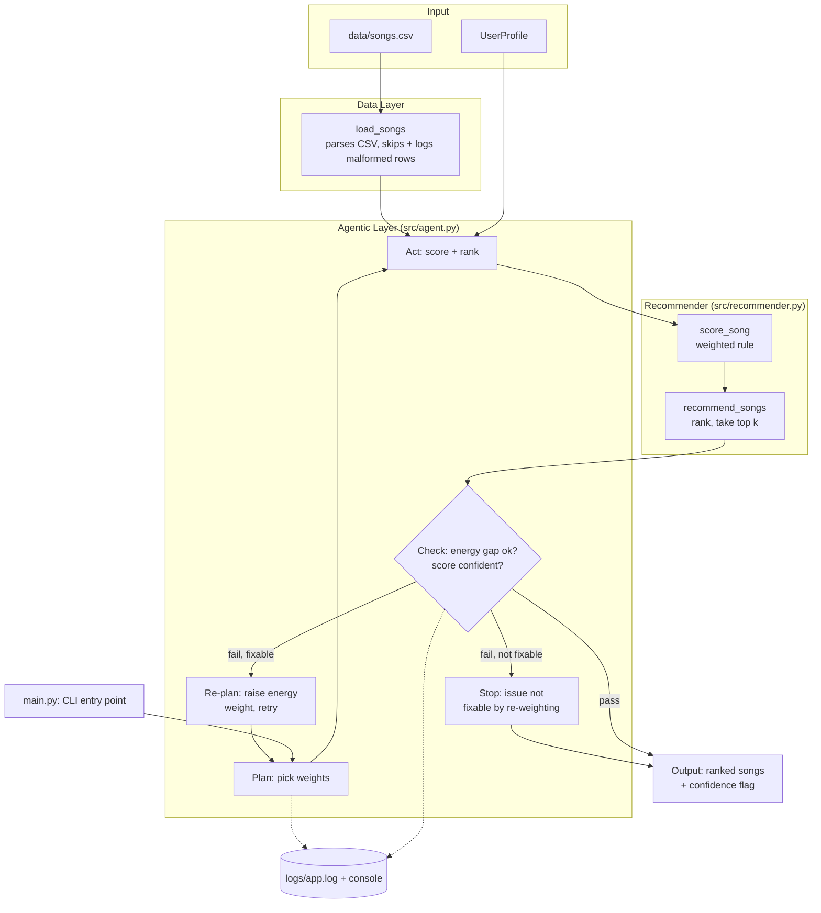

# 🎧 VibeMatch — A Self-Checking Music Recommender

## Original Project

This repository builds on **Music Recommender Simulation**, my Module 3 project for
CodePath's Applied AI course (AI110). The original goal was to build and explain a small
content-based recommender: represent songs and a single user's "taste profile" as data,
design a weighted scoring rule that turns that data into ranked recommendations, and
evaluate where the rule holds up versus where it breaks — including one deliberately
adversarial profile with conflicting signals (a classical/melancholy song requested at
high energy). That version scored an 18-song catalog, ranked it, and printed a
plain-language explanation for every recommendation, but it trusted its own scoring rule
completely — it had no way to notice when its own top pick was a bad match.

---

## Title and Summary

**VibeMatch** is a content-based music recommender that scores an 18-song catalog against
a user's stated taste (genre, mood, target energy, acoustic preference) and returns a
ranked, explained top-5. What makes it more than the original class assignment is an
**agentic self-check layer**: instead of running the scoring rule once and printing
whatever comes out, the system plans a scoring strategy, acts on it, checks its own top
result against explicit guardrails, and retries with an adjusted strategy when a check
fails — or honestly reports low confidence when it can't fix what it finds.

This matters beyond music recommendations: any system that turns a score into a
confident-sounding answer (a recommender, a classifier, an LLM response) can be
*fluently wrong* — high-confidence output that's actually a bad match. VibeMatch is a
small, fully-inspectable demonstration of the general fix: don't just trust the top
score, verify it against rules about what a good answer should look like, and say so
when you can't.

---

## Architecture Overview

Full diagram source: [`diagrams/architecture.mmd`](diagrams/architecture.mmd)



**How to read it:** data flows in from two places — the fixed song catalog and the
current `UserProfile` — into the **Recommender** module, which is unchanged in spirit
from the original project (a weighted-points scoring rule, sorted and truncated to the
top `k`). The new piece sits around it: the **Agentic Layer** doesn't call the
recommender once. It plans a set of weights, acts by scoring the whole catalog with
them, and checks the #1 result against two rules — is its energy actually close to what
was requested, and is its score high enough to call the match confident? If a check
fails *and* the failure is one a weight change could plausibly fix (an energy gap), it
re-plans with a higher energy weight and loops back through Act → Check. If the failure
can't be fixed that way (e.g. no genre/mood match exists anywhere in the catalog), it
stops immediately rather than retrying blindly. Every plan/act/check decision is logged,
and the final output always carries an explicit confidence flag alongside the ranked
list — nothing is presented as a good match without having passed the check.

---

## Setup Instructions

1. **Clone and enter the repo:**

   ```bash
   git clone https://github.com/rpathak0211/applied-ai-system-final.git
   cd applied-ai-system-final
   ```

2. **Create a virtual environment (optional but recommended):**

   ```bash
   python -m venv .venv
   source .venv/bin/activate      # Mac/Linux
   .venv\Scripts\activate         # Windows
   ```

3. **Install dependencies:**

   ```bash
   pip install -r requirements.txt
   ```

4. **Run the app:**

   ```bash
   python -m src.main
   ```

   This scores four built-in profiles (`src/main.py`'s `PROFILES` dict) against
   `data/songs.csv` and prints ranked, explained recommendations for each — see Sample
   Interactions below for real output.

5. **Check the logs:** every run writes to `logs/app.log` (auto-created, git-ignored) in
   addition to the console, so the agent's plan/act/check decisions are traceable after
   the fact, not just visible in the moment.

6. **Run the tests:**

   ```bash
   pytest
   ```

   `tests/test_recommender.py` covers the scoring/ranking rules; `tests/test_agent.py`
   covers the plan → act → check loop.

No API keys or external services are required — everything runs locally on the bundled
CSV catalog.

---

## Sample Interactions

Three real runs of `python -m src.main` (console logging omitted for readability — the
full trace for every attempt is in `logs/app.log`).

**1. A clean match — the agent passes on the first attempt:**

```
=== High-Energy Pop ===
User profile: {'genre': 'pop', 'mood': 'happy', 'energy': 0.9, 'likes_acoustic': False}

Top recommendations:

1. Sunrise City — Neon Echo (pop/happy)
   Score: 3.92
   Because: genre match (+2.00), mood match (+1.00), energy closeness (+0.92)

2. Gym Hero — Max Pulse (pop/intense)
   Score: 2.97
   Because: genre match (+2.00), energy closeness (+0.97)
```

**2. A multi-signal match — genre, mood, energy, and the acoustic bonus all line up:**

```
=== Chill Lofi ===
User profile: {'genre': 'lofi', 'mood': 'chill', 'energy': 0.3, 'likes_acoustic': True}

Top recommendations:

1. Library Rain — Paper Lanterns (lofi/chill)
   Score: 4.45
   Because: genre match (+2.00), mood match (+1.00), energy closeness (+0.95), acoustic bonus (+0.50)

2. Midnight Coding — LoRoom (lofi/chill)
   Score: 4.38
   Because: genre match (+2.00), mood match (+1.00), energy closeness (+0.88), acoustic bonus (+0.50)
```

**3. A conflicting profile — the agent tries to fix it, can't, and says so instead of
   hiding it:**

```
=== Adversarial: High-Energy Melancholy ===
User profile: {'genre': 'classical', 'mood': 'melancholy', 'energy': 0.9, 'likes_acoustic': False}

⚠️  Low confidence after 3 attempt(s): energy_mismatch: top pick's energy (0.20) is 0.70 away from the requested target (0.90)

Top recommendations:

1. Rainlight Sonata — Elena Cho (classical/melancholy)
   Score: 3.90
   Because: genre match (+2.00), mood match (+1.00), energy closeness (+0.90)

2. Storm Runner — Voltline (rock/intense)
   Score: 2.97
   Because: energy closeness (+2.97)
```

In case 3, `logs/app.log` shows the agent raised its energy weight across three attempts
(1.0 → 2.0 → 3.0) and "Rainlight Sonata" stayed the #1 pick every time — its 0.70 energy
gap is too large for any weight to out-score a genre+mood match in this catalog. The
score itself even climbed (3.30 → 3.60 → 3.90) while the actual match quality never
improved, which is exactly why the guardrail checks the *energy gap directly* instead of
trusting the score to reflect it.

---

## Design Decisions

**Why keep the underlying scoring rule instead of replacing it:** the original weighted
rule (genre +2.0, mood +1.0, energy closeness up to +1.0, acoustic +0.5) is simple,
auditable, and already stress-tested against four contrasting profiles. Rebuilding the
whole recommender wasn't the point of this pass — making it *self-aware about its own
failure modes* was, so the scoring logic was refactored to accept configurable weights
rather than rewritten.

**Why an agentic workflow over RAG or a fine-tuned model:** no LLM API key was configured
for this project, which ruled out RAG (retrieval + generation needs a model to generate
from) and made fine-tuning out of scope for an 18-song dataset anyway. An agentic
plan → act → check loop needed no external dependency, could run entirely on the existing
scoring logic, and mapped directly onto a weakness the original project had already
documented (see model_card.md) — that made it both feasible and directly useful, not
just a checkbox feature.

**Why the guardrail only retries fixable issues:** an early version raised the energy
weight on *any* failed check, including "no genre/mood match anywhere in the catalog."
That's not fixable by re-weighting — no amount of energy emphasis manufactures a genre
match that doesn't exist — so retrying anyway just burns attempts and (worse) can
accidentally inflate an unrelated low score past the confidence floor, making the agent
*falsely* confident. The fix: only retry when the specific flagged issue is one the
available lever (energy weight) can plausibly address; otherwise stop and report honestly.
The trade-off is a slightly more complex loop, but a self-check that can rationalize its
way past its own guardrail is worse than no self-check at all.

**Why fixed thresholds (0.35 energy gap, 1.0 confidence floor, 3 attempts) instead of
learned ones:** with a single 18-song catalog and no ground-truth "correct" answer to
train against, hand-picked thresholds validated against the known adversarial case were
the honest choice — the alternative would be fitting thresholds to the one adversarial
example available, which is really just memorizing it. The trade-off is that these
thresholds are heuristics, not statistically validated cutoffs, and would need
re-tuning on a larger or different catalog.

**Why log to a file instead of only stdout:** the point of the agent is to make its
reasoning inspectable, not just its final answer. Console output alone disappears once
the terminal scrolls; `logs/app.log` keeps every attempt's weights and guardrail verdicts
around for later review. The trade-off is an unbounded, unrotated log file — acceptable
for a small classroom project, not for a long-running production service.

---

## Testing Summary

**What worked:** all 6 tests pass — `tests/test_recommender.py`'s original 2 (sorted
output, non-empty explanations) plus 4 new agent tests covering a clean match (passes on
attempt 1), the adversarial energy-mismatch case (retries 3 times, ends not-confident),
an empty catalog (raises `ValueError` instead of crashing on an index error), and a
no-genre/mood-match profile.

**What didn't work initially:** the first version of the "no match anywhere" test failed.
The agent's retry strategy (raise the energy weight) was written to fire on *any* failed
check, so it also fired when the actual problem was "score too low because there's no
genre/mood match at all" — and raising the energy weight happened to push that low score
back above the confidence floor, flipping the result to `confident: True` for entirely
the wrong reason. Running the test suite caught this immediately (`assert True is False`)
before it shipped. The fix — only retry when the flagged issue is specifically an energy
mismatch — is described in Design Decisions above.

**What I learned:** a self-check loop needs to be tested for *unintended interactions*
between its guardrails, not just each guardrail in isolation — a fix aimed at one failure
mode can silently paper over a different one if the retry condition isn't scoped
narrowly enough. I also learned to always run the actual CLI and copy its real output
into documentation rather than writing hypothetical example output — doing that surfaced
the exact score progression (3.30 → 3.60 → 3.90) used as evidence in the Sample
Interactions section above, which I would not have gotten right by hand.

---

## Reflection

The original project's biggest lesson was that "recommendation" is just weighted
addition plus a sort, with no real understanding of music behind it. Building the
agentic layer on top added a second lesson: a system can be *systematically* wrong in a
way its own score never reveals, and catching that isn't a matter of tuning the score
harder — it requires stepping outside the scoring function entirely and asking a
different question ("is this actually close to what was requested?") that the original
formula was never designed to answer. That's a pattern that generalizes well past music:
any pipeline that turns a number into a confident-sounding answer needs an explicit,
separate check on whether the number actually means what it's being presented to mean —
otherwise "confident" and "correct" quietly become the same word.

For the graded responsible-AI reflection — how I collaborated with AI on this project,
one specific helpful suggestion, one specific flawed one, and this system's limitations —
see [`model_card.md`](model_card.md).
